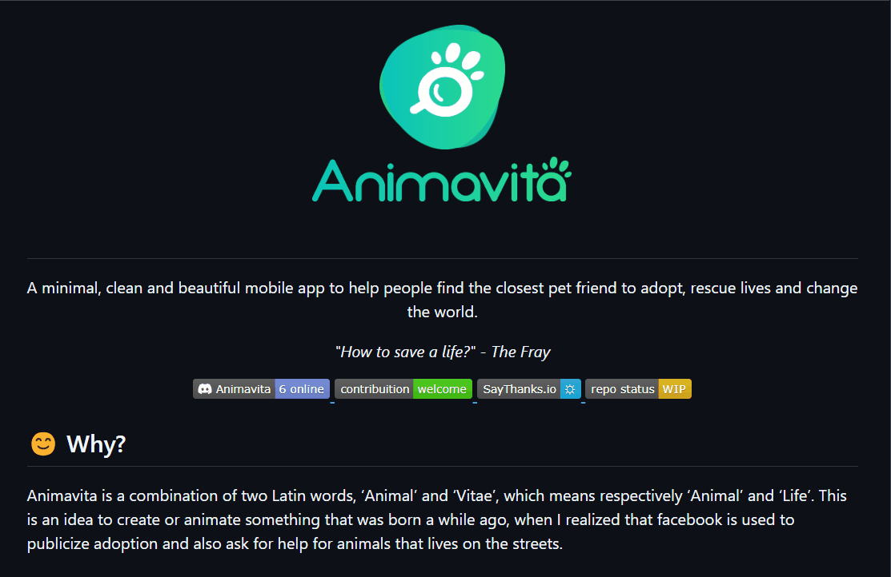

# Projeto com README
Um projeto de teste com um arquivo README📄

[]

## Tecnologias ultilizadas
- html
- css
- javascript
- github
- git
- vscode
##  Como utilizar

Clone o projeto
    
    git clone <url>

Acesse a pasta do projeto

     cd repositorio-com-README

